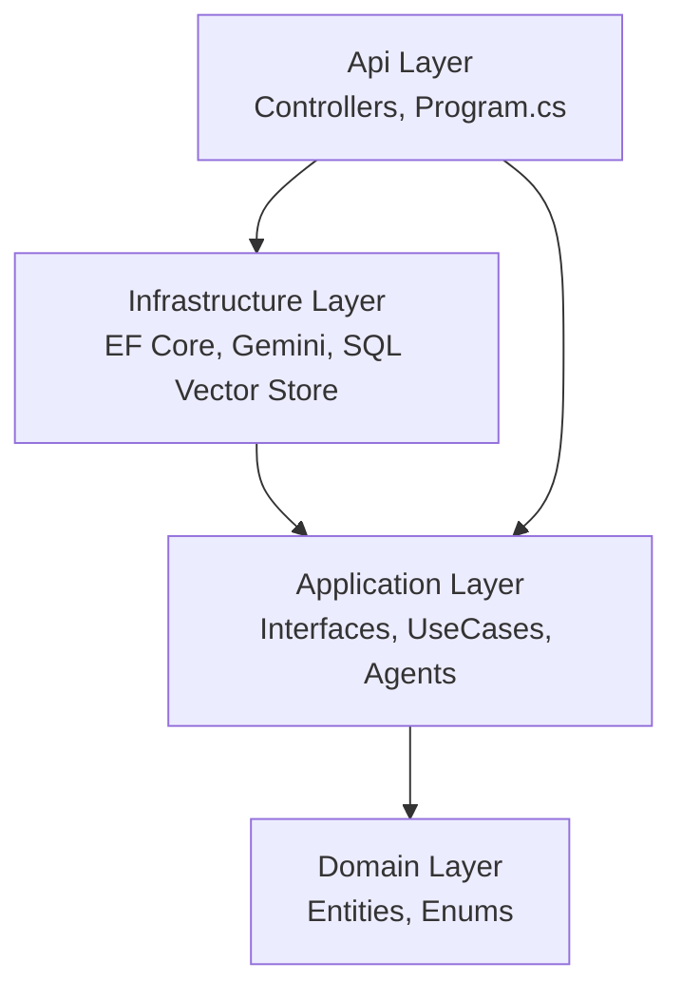
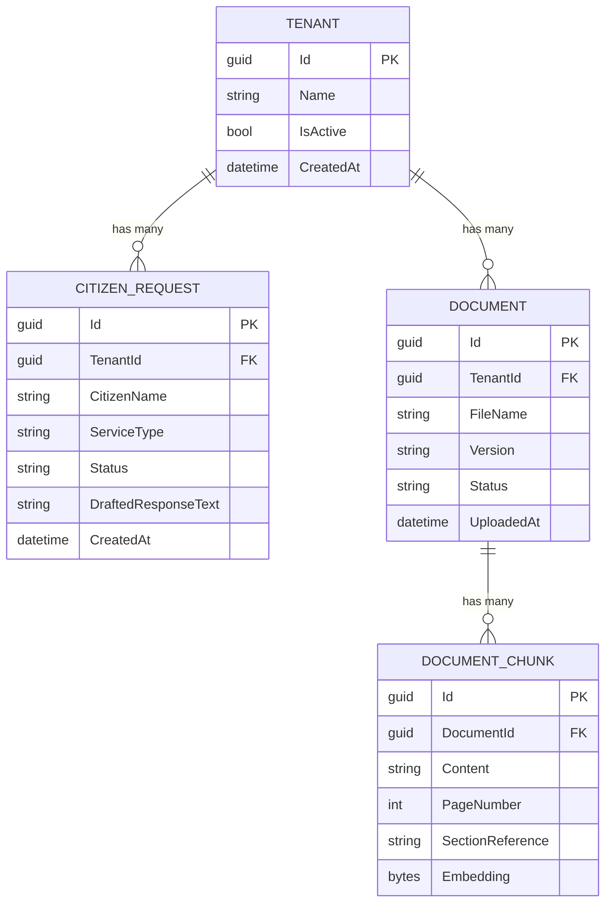
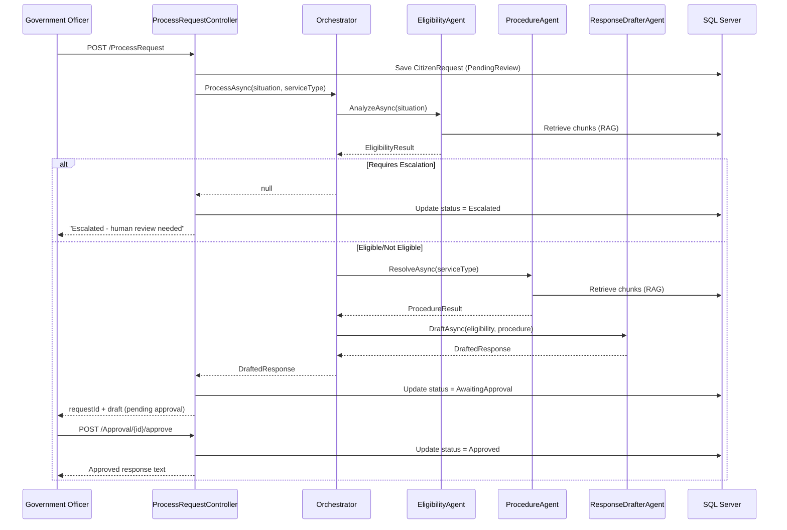

# Architecture Documentation — Domain Copilot

## Layer Dependency Diagram

This confirms the Clean Architecture boundary: `Domain` has zero outgoing 
dependencies, and all other layers depend inward toward it, never outward.

## Entity-Relationship Diagram

## Sequence Diagram — Full Request Flow

